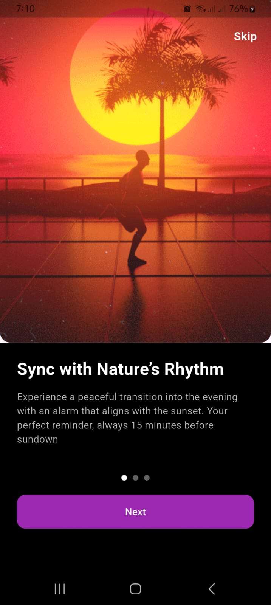

# Flutter Onboarding App

This is a Flutter mobile application built as part of a Junior Flutter Developer interview task. The app includes onboarding screens, location permission handling, alarm setting functionality, and notifications, following the provided Figma design.

## Project Overview
The app guides users through three onboarding screens, requests location permissions, allows setting alarms with a time picker, and triggers notifications for alarms. It adheres to the specified folder structure and uses clean architecture with state management.

## Flutter Version
- **Flutter**: 3.24.4 (stable channel)
- **Dart**: 3.8.1
- **sdk**: ^3.8.1

## Setup Instructions
Follow these steps to clone and run the project locally:

1. **Clone the Repository**:
   ```bash
   git clone https://github.com/jahangirjehad/Alarm_App.git
   cd onboarding_app
   ```

2. **Install Dependencies**:
   Ensure Flutter is installed (see [Flutter Installation Guide](https://flutter.dev/docs/get-started/install)). Then, run:
   ```bash
   flutter pub get
   ```


3. **Run the App**:
   Connect a device or start an emulator, then run:
   ```bash
   flutter run
   ```


## Project Structure
The code is organized as per the task requirements:
```
lib/
├── common_widgets/        # Reusable widgets
├── constants/            # Colors, strings, and other constants
├── features/             # Feature modules (onboarding, location, alarm)
├── helpers/              # Utility functions
├── networks/             # Network-related files (not used in this project)
├── main.dart             # App entry point
```

## Features
- **Onboarding Screens**: Three screens introducing syncing with nature, effortless syncing, and relaxation, with a "Skip" button.
- **Location Access**: Requests and displays the user's location (latitude/longitude).
- **Alarm Setting**: Allows users to set alarms using a time picker, displayed in a list.
- **Notifications**: Triggers notifications when alarms go off.
- **Local Storage**: Saves alarms using `sqflite`.

## Screenshots
Below are screenshots showcasing the app's UI:




*Note*: Screenshots are placeholders. Replace with actual images from your project in the `screenshots/` folder.


## Troubleshooting
- **Location Issues**: Ensure location services are enabled on the device/emulator.
- **Notifications**: Verify that the device allows notifications for the app.
- **Dependencies**: Run `flutter clean` and `flutter pub get` if you encounter build issues.


Thank you for reviewing my project!